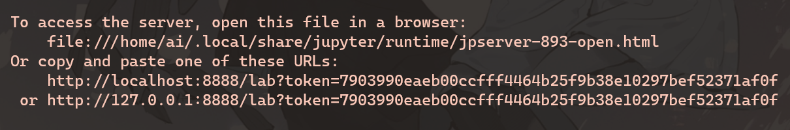

# `README.md` for [mira-bing](https://github.com/Ai-Yukino/mira-bing)

{Fun image goes here}

---

## ❄ Setup ❄

### ⚪ Clone this repo

Open your prefered terminal. Navigate to where you want to clone this repo, e.g.

```
cd documents
```

Run

```
git clone https://github.com/Ai-Yukino/mira-bing
```

Navigate inside the repo with

```
cd mira-bing
```

### ⚫ Install virtual environment

Run

```
conda env create -f mira-bing.yml
```

### ⚪ Activate virtual envrionment

Run

```
conda activate mira-bing
```

## 🌸 Generate Jupyter notebook 🌸

### ⚪ Navigate to notebook folder

Run

```
cd notebooks/{path-to-notebook}
```

### ⚫ Generate notebook

Run

```
jupytext --to ipynb {notebook-name}.py
```

to generate the notebook as a `{notebook-name}.ipynb` file.

## ❄ Open Jupyter notebook ❄

Run

```
jupyter lab --no-browser
```

and then click one of the links that pops up in your terminal to open the notebook in Jupyter Lab.

<center>

</center>

## ❄ Update virtual environment config ❄

`cd` into the root directory `mira-bing`. Then run

```
conda env export --from-history mira-bing.yml
```

to update the `mira-bing.yml` config file with any new Python libraries you imported.
